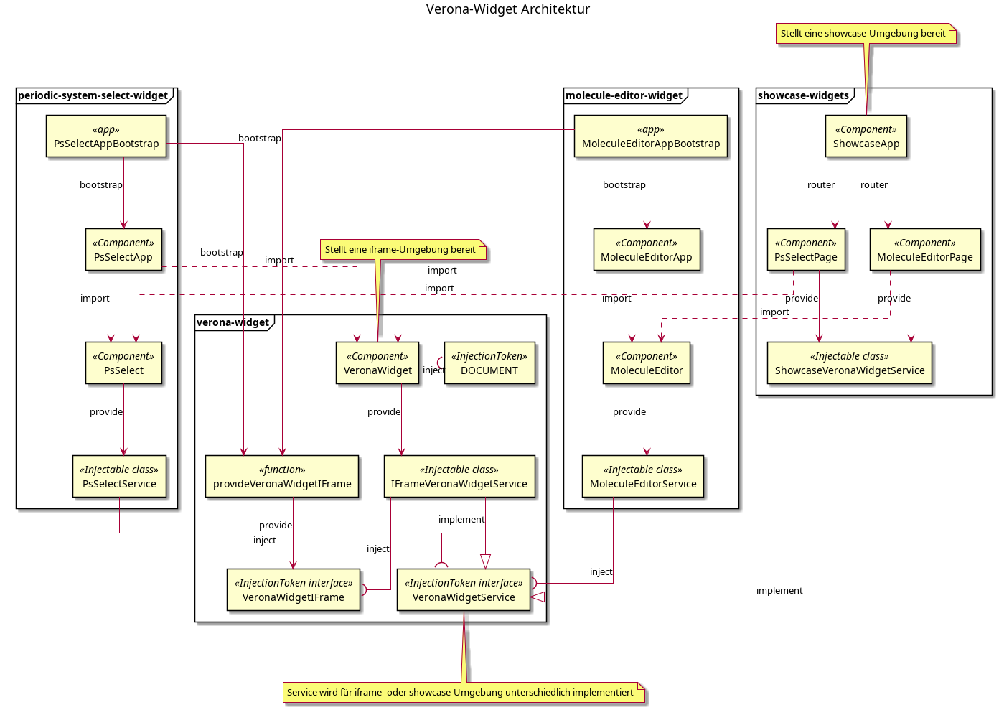
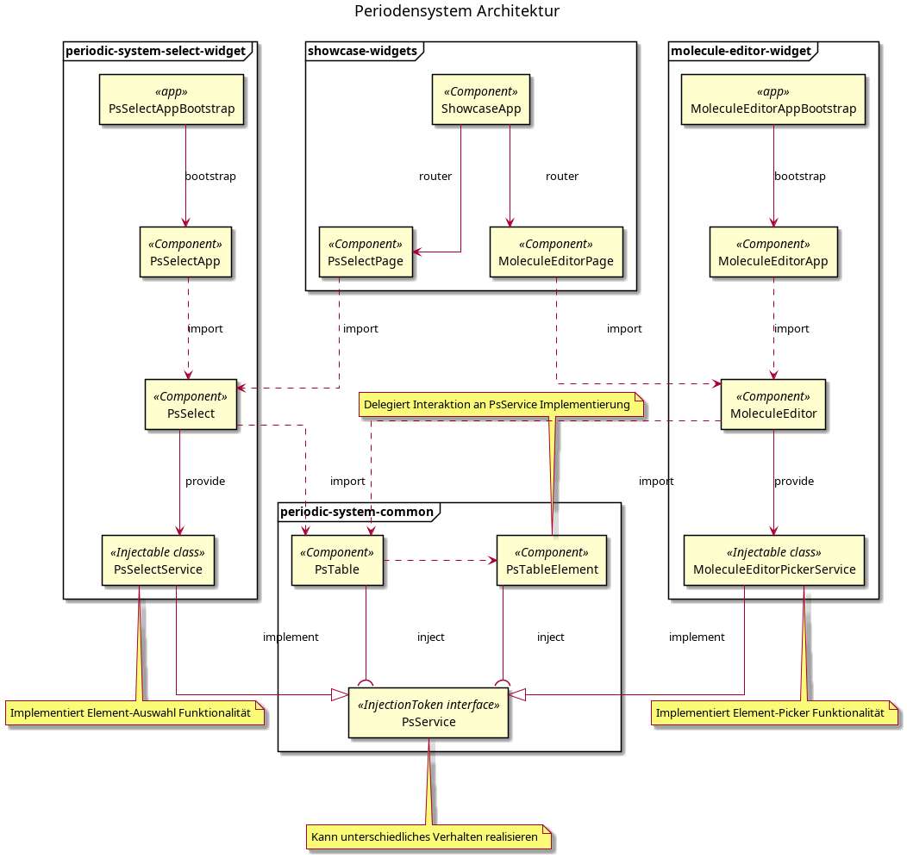
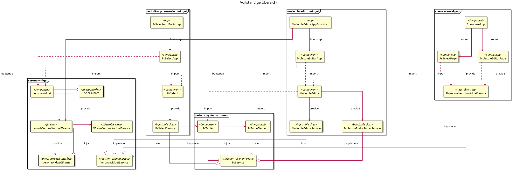

# IQB Widgets

wer denkt was GmbH, 2025

## Build Widgets

Benötigt Node.js ≥ v22.x

```
$ npm install
$ npm run build:all
$ npm run inline:all
```

Build-Dateien:

- Periodensystem Auswahl Widget in `dist/periodic-system-select-widget/browser/index_packed.html`
- Molekül Editor Widget in `dist/molecule-editor-widget/browser/index_packed.html`

## Serve Showcase

Showcase-App auf http://localhost:4200/

```
$ npm install
$ npm run start:all
```

Optional in zweitem Terminal, um Library-Module fortlaufend zu bauen:

```
$ npm run watch:all
```

## Widget Dummy Host

Um Widgets in `index_packed.html` Dateien zu testen, wird ein Widget-Dummy-Host bereitgestellt.
Diese Testumgebung kann packed Widgets laden, konfigurieren, und ausführen.
Benötigt Docker.

Widget Dummy Host auf http://localhost:4400/

```
$ docker compose up
```

1. Wähle eine `index_packed.html` Datei als "Widget HTML File"
2. Konfiguriere Widget Parameters und initialen State
3. Klick "Create Widget"

## Tests

[Karma Tests](https://karma-runner.github.io/latest/index.html), welche prüfen, ob die Komponenten fehlerfrei rendern können.
Benötigt [Google Chrome](https://www.google.com/intl/de_de/chrome/) Browser.

```
$ npm run test:all
```

## Architektur

Die IQB-Widgets sind modular aufgebaut. Es gibt folgende Kategorien von Modulen:

- Library Modul: Wiederverwendbare Komponenten und Services für andere Module
  - `verona-widget`: Komponenten und Services für die Integration mit Verona-Widget
  - `perioduc-system-common`: Komponenten uns Services für das interaktive Periodensystem
- Widget Modul: Widget-Applikationen, welche in IFrame-Elementen eingebunden werden können
  - `periodic-system-select-widget`: Widget zur Auswahl von Elementen im Periodensystem
  - `molecule-editor-widget`: Widget zum Bauen und Bearbeiten von Molekülen
- Showcase Modul: Alleinstehende Applikation, welche Widget-PsSelectApp Komponenten demonstrieren
  - `showcase-widgets`: Demo für Widget-PsSelectApp Komponenten

Jedes Modul enthält Services (injectable Interfaces oder Klassen), welche die Funktionalität der Komponenten bestimmen
und entweder von den Komponenten bereitgestellt ("provided") oder benötigt ("injected") werden.

### Modul `verona-widget`

Das `verona-widget` Modul bietet Integration mit der [Widget-Spezifikation von Verona-Interfaces](https://verona-interfaces.github.io/widget-docs/).

- Komponente `VeronaWidget` (Selektor `<lib-verona-widget>`)
  - Verantwortlich für Integration und Kommunikation mit Widget IFrame
  - Input `metadataSelector`, welcher als CSS-Selektor das [Verona-Modul Metadaten](https://verona-interfaces.github.io/intro/metadata.html) Element sucht
  - Provides `IFrameVeronaWidgetService` als Implementierung für `VeronaWidgetService`
- Interface `VeronaWidgetService`
  - Verwaltet Widget-Zustand und Kommunikation mit Widget-Host
  - Verfügbar als InjectionToken
- Klasse `IFrameVeronaWidgetService`, implementiert `VeronaWidgetService`
  - Implementierung für Ausführung des Widgets innerhalb eines `<iframe>` in einer Verona Host-Applikation
  - Injects `VeronaWidgetIFrame`, welches von der Applikation mit `provideVeronaWidgetIFrame` bereitgestellt werden kann
  - Verfügbar als Injectable
- Funktion `provideVeronaWidgetIFrame`, stellt ein `VeronaWidgetIFrame` basierend auf dem aktuellen `window` bereit
- Klasse `DummyVeronaWidgetService`, implementiert `VeronaWidgetService`
  - Implementierung, welche innerhalb von Tests eine Widget-Umgebung mocked
  - Wird bereitgestellt durch die `provideDummyVeronaWidgetService` Funktion

### Modul `periodic-system-common`

Das `periodic-system-common` Modul bietet Komponenten für ein interaktives Periodensystem.

- Interface `PsService` bestimmt Interaktion und Erscheinungsbild der Periodensystem-Komponenten
  - Zusammen mit Interface `PsAppearance`, welches das Erscheinungsbild konfiguriert
  - Zusammen mit Interface `PsInteraction`, welches Interaktion mit dem Periodensystem bestimmt
  - Verfügbar als InjectionToken
- Komponente `PsTable` (Selektor `<lib-ps-table>`)
  - Verantwortlich für die Darstellung eines interaktiven Periodensystems
  - Zusammen mit Komponente `PsTableElement` (Selektor `<lib-ps-table-element>`)
  - Injects `PsService`, welches von einer darüberliegenden Komponente bereitgestellt werden muss
- Konstante `PsData` enthält konkrete Daten über die Elemente des Periodensystems

### Modul `periodic-system-select-widget`

Das `periodic-system-select-widget` ist ein Verona-Widget Modul, welches die interaktive Auswahl eines oder mehrerer Elemente aus dem Periodensystem ermöglicht.

- Angular Application-Projekt
- Index `index.html` enthält ein `<script type="application/ld+json">`, welches Metadaten über das Verona-Modul bereitstellt
- Bootstrap `psSelectAppConfig` konfiguriert die Application
  - Provides `VeronaWidgetIFrame` per `provideVeronaWidgetIFrame`
  - Bootstraps `PsSelectApp`, welche ein `VeronaWidget` mit `PsSelect` als Content rendert
- Komponente `PsSelect`
  - Provides `PsSelectService` als `PsSelect` Implementation
  - Rendert direkt eine `PsTable` Komponente
- Klasse `PsSelectService`
  - Verantwortlich für Verhalten des Widgets, agiert als Adapter von Widget zu Auswahl-Funktionalität
  - Implementiert `PsService` mit `PsAppearance` und `PsInteraction`
  - Injects `VeronaWidgetService` für Kommunikation und Daten

### Modul `molecule-editor-widget`

Das `molecule-editor-widget` ist ein Verona-Widget Modul, welches die interaktive Erstellung und Bearbeitung von Molekülen mitteln Elementen aus dem Periodensystem ermöglicht.

- Angular Application-Projekt
- Index `index.html` enthält ein `<script type="application/ld+json">`, welches Metadaten über das Verona-Modul bereitstellt
- Bootstrap `moleculeEditorAppConfig` konfiguriert die Application
  - Provides `VeronaWidgetIFrame` per `provideVeronaWidgetIFrame`
  - Bootstraps `MoleculeEditorApp`, welche ein `VeronaWidget` mit `MoleculeEditor` als Content rendert
- Komponente `MoleculeEditor`
  - Provides `MoleculeEditorService`
  - Provides `MoleculeEditorRenderer`
  - Provides `MoleculeEditorImageService`
  - Provides `MoleculeEditorPickerService` als `PsSelect` Implementation
  - Rendert den Molekül-Editor mit MatDrawer, PsTable, EditorControls, und EditorCanvas


### Modul `showcase-widgets`

Das `showcase-widgets` ist ein Angular Application-Modul, welches die Funktionsweise der hier verfügbaren Widgets außerhalb eines Widget-Host demonstriert.
Dieses Modul kann mit `ng serve` zum Test, Evaluation, und Entwicklung der Widgets verwendet werden.

- Angular Application-Projekt mit App-Router
- Klasse `ShowcaseVeronaWidgetService`, implementiert `VeronaWidgetService`
  - Implementierung für Ausführung des Widgets innerhalb einer Showcase-Page, _ohne_ Verona-Host Applikation
  - Injects `ShowcaseVeronaWidgetConfig`, eine initiale und reaktive Konfiguration des Widgets bereitstellt
  - Injects `MatSnackbar` für Benachrichtigungen bei Widget-Events
  - Inhalt der Komponente muss eine `showcaseVeronaWidget` Direktive enthalten, um korrekt zu funktionieren
  - Verfügbar als Injectable
- Funktion `provideShowcaseVeronaWidgetService`
  - Provides `ShowcaseVeronaWidgetConfig`
  - Provides `ShowcaseVeronaWidgetService` als `VeronaWidgetService` Implementierung
- Direktive `ShowcaseVeronaWidgetDirective` (Selektor `*showcaseVeronaWidget`)
  - Verwaltet die Interaktion und den Inhalt des Widgets in einer Showcase-Umgebung
  - Input `showcaseVeronaWidget` als Module-Info (Tupel mit Modul-Typ und Modul-ID)
  - Injects `ShowcaseVeronaWidgetService`
- Bootstrap `showcaseAppConfig` konfiguriert die Application
  - Provided einen Router mit `routes`
  - Bootstraps `WidgetShowcaseApp`, welche ein Navigationsmenü und Router-Outlet rendert
- Komponente `PsSelectPage`, verfügbar unter Route `/ps-select`
  - Provides `ShowcaseVeronaWidgetConfig`/`ShowcaseVeronaWidgetService` mit `provideShowcaseVeronaWidgetService`
  - Stellt eine `PsSelect` Komponente dar
- Komponente `MoleculeEditorPage`, verfügbar unter Route `/molecule-editor`
  - Provides `ShowcaseVeronaWidgetConfig`/`ShowcaseVeronaWidgetService` mit `provideShowcaseVeronaWidgetService`
  - Stellt eine `MoleculeEditor` Komponente dar

## Architekturdiagramme

`VeronaWidgetService` Implementierungen für unterschiedliche Umgebungen



`PsService` Implementierungen für unterschiedliche Interaktionen



Gesamtübersicht der Architektur und Abhängigkeiten



---

This project was generated using [Angular CLI](https://github.com/angular/angular-cli) version 20.3.9.
